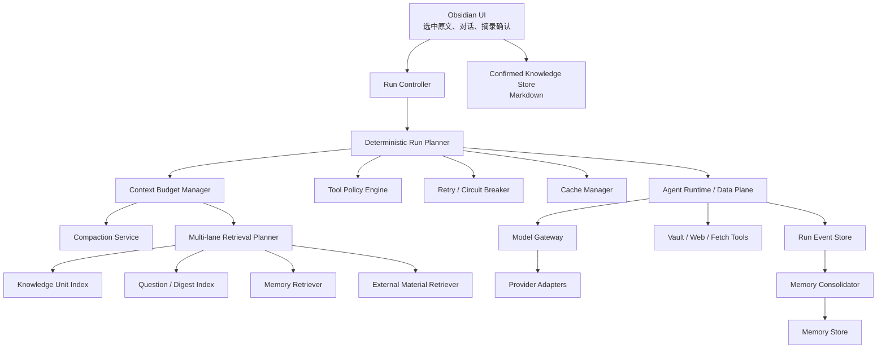
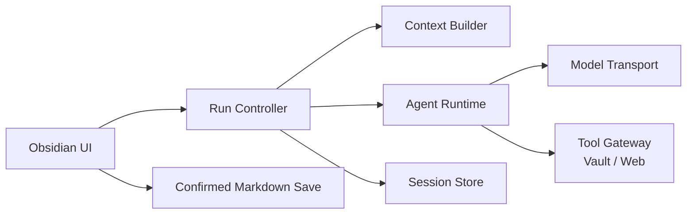
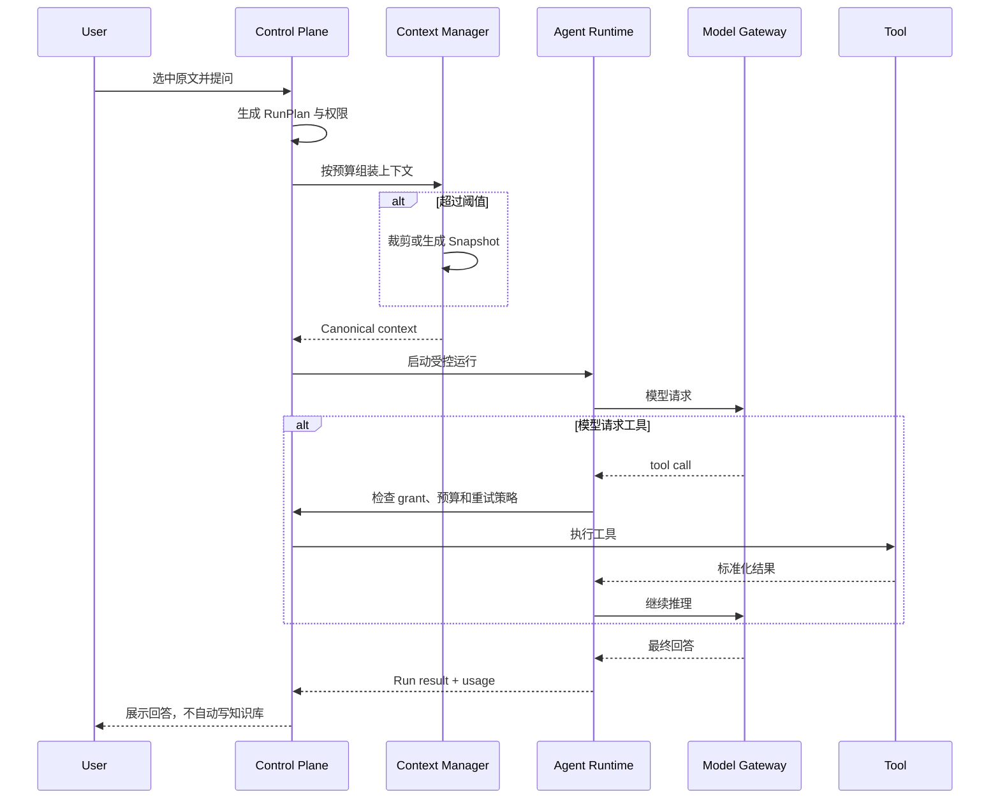
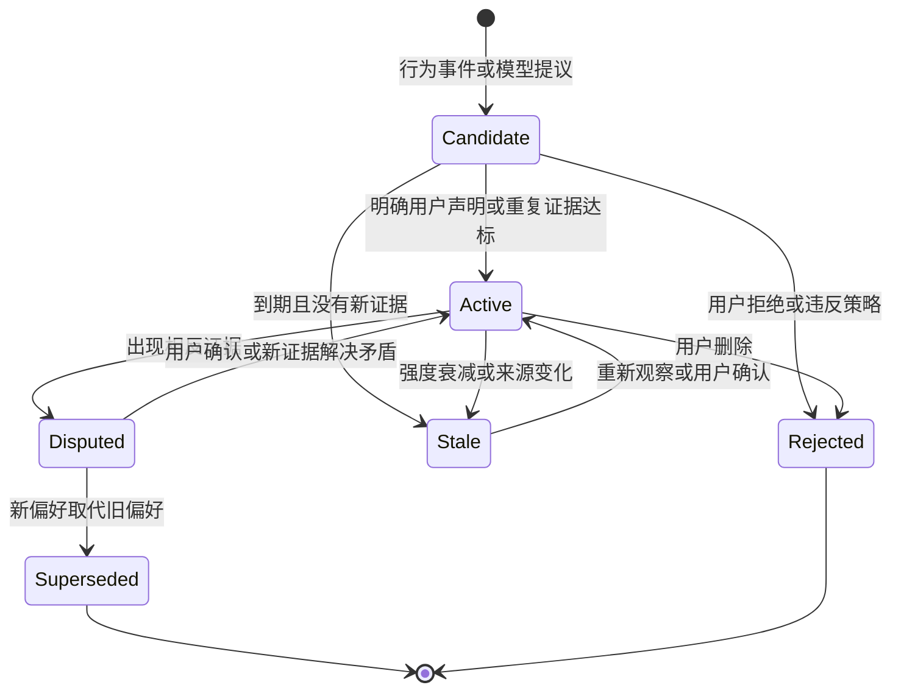

# AI Reading Companion Agent 技术设计

> 状态：Draft / 复杂度与性能复审版，不代表已经实现  
> 日期：2026-08-10  
> 适用项目：AI Reading Companion 1.2.x 之后的 Agent 架构演进

## 1. 文档目的

本文把当前“模型调用 + 工具循环”提升为可落地、可测试、可迁移的学习型 Agent 技术架构，重点回答：

1. 长对话如何压缩，压缩后怎样防止丢失用户纠正、来源和未解决问题；
2. 原始对话如何设定容量和保留期限，而不是无限期占用本地存储；
3. 学习偏好、历史问题和知识掌握状态怎样形成 Memory，怎样过期、纠正和删除；
4. 怎样区分文件、外部材料、用户产出与已经内化的知识；
5. 历史讨论、个人知识和外部材料怎样共同参与检索，而不被混为一谈；
6. Prompt Cache、本地缓存和 Memory 如何区分，怎样观测是否命中；
7. 文件检索、Web Search、工具重试和写入操作怎样由 Control Plane 控制；
8. 桌面端、移动端和选择性同步条件下，数据应该放在哪里；
9. 如何分阶段实现并验证，而不是一次性重写现有插件。
10. 怎样控制包体、启动耗时、运行时内存与首字等待，确保桌面端和移动端都可用。

本文采用“最佳判断”方式先给出完整默认方案。所有需要产品确认的默认值集中在第 20 节，后续可以逐项调整。

## 2. 产品约束

Agent 的目标不是自动构建复杂知识图谱，而是帮助用户：

> 用自己的话解释核心知识，知道依据在哪里、它与哪些已掌握知识真正相关，并保留由用户确认的个人知识。

因此技术设计必须遵循以下边界：

- AI 回答、Web 搜索结果和自动推断都不是个人知识；
- 外部材料进入 Vault 只代表“可检索”，不代表“已经成为用户知识”；
- 外部材料可以作为 Markdown 保存在 Vault，但只有用户确认、改写或明确归档的内容才能进入 Personal Knowledge 层；
- Agent 可以维护操作性 Memory，但必须可查看、可纠正、可删除并保留证据；
- 不因“可能以后有用”而把全部历史塞进模型上下文；
- 不默认生成大量关系，关系建议必须有明确依据并由用户确认；
- 不依赖某一家模型服务商的专属能力保证系统正确性；
- Control Plane 是确定性程序，不是另一个自由发挥的规划 Agent。
- 任何新模块必须证明它解决了当前用户问题；仅为了未来可能需要的扩展点，不进入首版实现。
- 首版优先完成“选中材料 → 提问 → 找到必要依据 → 对话 → 用户确认保存”的闭环，不以实现完整参考架构为目标。

## 3. 当前实现基线

当前 `src/agent-runtime.ts` 已经实现通用的模型—工具循环：

- 将消息发送给模型；
- 接收 tool calls；
- 顺序执行已注册工具；
- 将工具结果追加到消息；
- 最多执行固定轮数；
- 支持取消信号和基础运行事件。

当前 `src/main.ts` 中的对话会话保存在 `AiQuestionView` 的内存数组中。视图关闭、插件重载或应用退出后，不保证恢复。`Plugin.saveData()` 当前主要保存插件设置。

当前 `src/web-search.ts` 已适配多个搜索服务，但每次请求直接执行，尚无统一的超时、重试、熔断、缓存和会话复用策略。

截至 2026-08-10 的发布基线：

| 产物 | 当前大小 | gzip 估算 | 结论 |
|---|---:|---:|---|
| `main.js` | 82.3 KiB | 23.0 KiB | 当前很轻，不是性能瓶颈 |
| `styles.css` | 30.0 KiB | 4.8 KiB | 可接受 |
| `manifest.json` | 0.3 KiB | - | 可忽略 |

当前没有运行时第三方依赖，构建已启用生产压缩和 tree shaking；`onload()` 也没有网络请求或全 Vault 扫描。这些是后续演进必须守住的基线。真正的近期风险是图片请求：普通位图目前可以把最多 9 张、总计 80 MB 的原文件直接读入并转成 Base64，未统一缩放或压缩。Base64 还会额外膨胀约三分之一，这比新增几个 TypeScript 类更容易造成移动端卡顿和内存峰值。

现有 Runtime 暂不承担以下职责：

- token 预算和上下文准入；
- Compaction；
- Provider Prompt Cache 配置和命中统计；
- 本地结果缓存；
- 工具级权限；
- 请求超时、退避重试、熔断和降级；
- 运行 checkpoint 和崩溃恢复；
- 对话持久化和数据淘汰；
- Memory 提取、合并、衰减和审计。

这个边界应该保留：Runtime 继续作为小型执行内核，但首版只增加必要的外围控制，不把每一种策略都拆成常驻服务。

## 4. 核心术语与七类数据

系统必须把以下数据严格分开：

| 数据 | 含义 | 是否进入模型上下文 | 是否同步 | 是否可自动删除 |
|---|---|---:|---:|---:|
| External Material | 公众号文章、网页剪藏、书籍原文等外部输入 | 相关时按片段检索 | 跟随 Vault | 原文件由用户管理 |
| User Artifact | 用户自己写的草稿、复述、编辑后的摘录 | 相关时优先检索 | 跟随 Vault | 绝不由插件自动删除 |
| Confirmed Knowledge | 用户明确确认、组织并愿意作为个人知识使用的内容 | 相关时优先检索 | 跟随 Vault | 绝不由插件自动删除 |
| Raw Transcript | 原始用户消息、AI 回答、工具调用记录 | 最近部分或按需 | 默认不跨设备 | 可以，受保留策略约束 |
| Compaction Snapshot | 原始对话的结构化工作摘要 | 是 | 可选 | 可以保留有限版本 |
| Learning Memory | 学习偏好、纠正、历史问题、掌握状态 | 检索后少量加入 | 建议可选同步 | 候选和过期项可以 |
| Disposable Cache | 搜索结果、网页正文、解析结果、embedding、压缩结果缓存 | 命中后按需 | 不同步 | 随时可以 |

“原始对话必须永久保存”修改为：

> 原始对话在明确的时间、数量和字节预算内保留；用户可以固定、导出或提前删除。到达淘汰条件时，系统只为具有学习价值的会话保留最小可审计摘要。

### 4.1 文件是容器，不是知识状态

不能用“是不是 Markdown 文件”或“位于哪个文件夹”判断一段内容是不是用户知识。文件只是存储容器，同一个文件可能同时包含：

- 外部转载原文；
- AI 生成的解释；
- 用户选中并保存的 AI 片段；
- 用户自己的批注和改写；
- 用户确认的结论；
- 尚未解决的问题。

因此系统在文件层之上建立 `KnowledgeUnit`。一个 Unit 通常是一个标题下的段落、列表项、Callout、块引用或用户保存的摘录，而不是整篇文件。

### 4.2 三个正交维度

每个 Knowledge Unit 至少具有三个互不替代的维度：

| 维度 | 要回答的问题 | 示例 |
|---|---|---|
| Provenance / Origin | 内容最初来自谁、从哪里来 | 用户原创、AI 生成、公众号导入、书籍原文 |
| User Action / Ownership | 用户对它做过什么 | 未阅读、选中、提问、保存、编辑、链接、重写 |
| Learning / Epistemic State | 它在用户知识体系中处于什么状态 | 材料、候选理解、已复述、已应用、待复核 |

例如，“用户选中 AI 回答并编辑后保存”应记录为：

```text
origin = ai_generated 或 mixed
userAction = edited_and_saved
ownership = user_curated
learningState = engaged 或 articulated
```

它确实是用户行为产生的资产，但不能仅因为保存过就认定用户已经掌握。只有用户用自己的话解释或在新问题中应用，才形成更强的内化证据。

外部原文不会因为被阅读、提问或高亮就改变 origin；它始终是 External Material。用户基于它写出新的解释时，系统创建一个新的 User Artifact，并用 `derived_from` 指向原文。这样既保留个人知识，又不会丢失依据。

### 4.3 Document Registry

文件级记录只提供默认分类，块级 Unit 可以覆盖它：

```ts
type ContentOrigin =
  | "user_authored"
  | "user_confirmed_ai"
  | "external_import"
  | "ai_generated"
  | "mixed"
  | "unknown";

interface DocumentRecord {
  id: string;
  filePath: string;
  originDefault: ContentOrigin;
  sourceKind: "personal_note" | "web_clip" | "book" | "conversation_note" | "mixed";
  importer?: string;
  sourceUrl?: string;
  importedAt?: number;
  contentHash: string;
  classificationSource: "manual" | "plugin_event" | "frontmatter" | "folder_rule" | "inferred";
  classificationConfidence: number;
  userOverride?: ContentOrigin;
  updatedAt: number;
}
```

分类优先级：

```text
用户手动指定
  > 插件明确保存事件
  > 文件 frontmatter / 导入器元数据
  > 用户配置的目录规则
  > 低置信度自动推断
```

公众号文章可通过 `source`、`source_url`、导入器字段或用户配置的“外部材料目录”识别。历史文件无法可靠判断时标为 `unknown`，不能擅自归为个人知识。

### 4.4 Knowledge Unit

```ts
type UserActionState =
  | "untouched"
  | "opened"
  | "selected"
  | "questioned"
  | "saved"
  | "edited"
  | "rewritten"
  | "linked"
  | "applied";

type EpistemicStatus =
  | "source_material"
  | "candidate_understanding"
  | "user_articulated"
  | "user_applied"
  | "confirmed_for_use"
  | "stale"
  | "disputed"
  | "superseded";

interface KnowledgeUnit {
  id: string;
  documentId: string;
  anchor: SourceAnchor;
  contentHash: string;
  origin: ContentOrigin;
  userAction: UserActionState;
  epistemicStatus: EpistemicStatus;
  conceptKeys: string[];
  provenanceIds: string[];
  derivedFromUnitIds: string[];
  sourceFreshness: "current" | "changed" | "unknown";
  lastEngagedAt?: number;
  reviewAfter?: number;
  revision: number;
}
```

默认不向 Markdown 自动写入大量内部字段。Document Registry 和 Knowledge Unit Index 保存在 Operational Store，通过路径、标题、块 ID 和 content hash 定位。用户确认知识时可以选择生成稳定的 Obsidian block ID，以获得跨重命名和跨设备链接能力。

### 4.5 关系也有身份

相似不等于相关，更不等于用户已经建立了连接。关系分四级：

```ts
type RelationStatus = "explicit" | "observed" | "proposed" | "confirmed";

interface RelationRecord {
  id: string;
  fromUnitId: string;
  toUnitId: string;
  type: "derived_from" | "explains" | "example_of" | "extends" | "contradicts" | "same_question";
  status: RelationStatus;
  createdBy: "markdown_link" | "user_action" | "agent" | "user";
  evidenceIds: string[];
  confidence: number;
  createdAt: number;
}
```

允许长期保存的关系：

- 用户自己建立的 Obsidian 链接；
- 用户从原文保存摘录时产生的 `derived_from`；
- 用户在同一段个人总结中明确连接的概念；
- 用户确认过的 AI 关系建议。

语义相似、关键词共现或 AI 临时推断只能成为本轮 `proposed` 关系。它帮助构造 Context，但不会自动写入知识图谱。

## 5. 总体架构：目标边界，不是首版清单



设计上只有一个面向用户的学习 Agent。图中的 Planner、Compaction、Cache、Policy、Memory 等都是受类型、预算和状态机约束的服务，不是多个自由对话的 Agent。

这张图描述长期职责边界，不表示每个方框都要在第一版成为独立模块、数据库表或后台任务。如果按图一次性实现，会同时引入存储迁移、索引一致性、Memory 误判、移动端性能和多服务商兼容问题，验证面过大，属于过度设计。

### 5.1 首版最小架构



首版只保留六个可测试职责：

| 职责 | 首版做什么 | 首版不做什么 |
|---|---|---|
| Run Controller | 固定预算、取消、超时、有限重试、工具授权、阶段状态 | 独立规划 Agent、复杂熔断网络 |
| Context Builder | 当前选区、最近对话、用户明确知识、必要材料，超限时一次结构化摘要 | 全库常驻语义图、多级自动关系分析 |
| Agent Runtime | 保留现有模型—工具循环 | Memory 提炼、索引维护 |
| Model Transport | 统一完整响应和流事件；按服务商能力降级 | 假设所有 OpenAI 兼容地址都支持真流式 |
| Tool Gateway | Vault 只读检索、Web Search、结果截断与来源 | 任意文件系统访问、后台全库扫描 |
| Session Store | 有上限的会话、消息、摘要和少量显式偏好 | 复杂自动 Memory、同步冲突合并 |

`RunPlan` 在首版只是 Run Controller 创建的不可变 TypeScript 对象；Tool Policy、Retry Policy 和 Cache Policy 可以先是纯函数或配置，不需要各自成为服务。`DocumentRecord`、`KnowledgeUnit` 和 `RelationRecord` 仍保留为领域语言，但首版按需从 Markdown、frontmatter、来源锚点和用户行为派生，不建立完整持久化知识图谱。

### 5.2 延后条件

只有出现以下可观测信号，才升级到完整目标架构：

- 关键词和 Obsidian 元数据检索无法覆盖真实问题，再评估增量索引或 embedding；
- 会话超出上下文预算的比例持续升高，再引入多级 Compaction；
- 用户反复纠正相同讲解方式且能看到明确收益，再开启 Memory candidate 自动提取；
- 单一重试策略造成可测的级联失败，再引入 circuit breaker；
- 用户明确需要跨设备恢复对话或 Memory，再设计 Sync Pack 和 tombstone。

“可能以后有用”不是升级条件。

## 6. Control Plane 与 Run Plan

### 6.1 职责

Control Plane 在模型运行前生成 `RunPlan`，并在运行过程中检查每一个外部动作。模型不能修改预算、扩大文件范围或自行改变重试策略。

```ts
interface RunPlan {
  runId: string;
  sessionId: string;
  contextEpoch: number;
  model: ModelPlan;
  context: ContextPlan;
  toolGrants: ToolGrant[];
  retry: RetryPolicy;
  cache: CachePolicy;
  retention: RetentionPolicyRef;
  memory: MemoryPolicy;
  budgets: RunBudgets;
  createdAt: number;
}

interface RunBudgets {
  maxInputTokens: number;
  maxOutputTokens: number;
  maxToolRounds: number;
  maxToolCalls: number;
  maxVaultSearches: number;
  maxVaultReads: number;
  maxVaultResultTokens: number;
  maxWebSearches: number;
  maxFetchedBytes: number;
  maxWallTimeMs: number;
}
```

### 6.2 状态机

```text
CREATED
  -> PLANNING
  -> AWAITING_PERMISSION（需要扩大权限时）
  -> ASSEMBLING_CONTEXT
  -> COMPACTING（可选）
  -> CALLING_MODEL
  -> EXECUTING_TOOL
  -> CALLING_MODEL（工具循环）
  -> PERSISTING_RESULT
  -> COMPLETED

任意阶段 -> FAILED / CANCELLED
```

取消不是 UI 状态，而是 Run Controller 拥有的运行状态。更精确的内部转换为：

```text
任意运行态 -> CANCEL_REQUESTED -> CANCELLED
```

`CANCEL_REQUESTED` 表示已经禁止启动新模型调用、工具调用和持久化写入，但某个无法中止的底层请求可能仍在等待返回；其返回值必须被丢弃。

以下时点写入 checkpoint：

- RunPlan 生成后；
- 每次模型响应后；
- 每次工具执行完成后；
- Compaction Snapshot 写入后；
- 最终回答写入后。

应用异常退出后，只恢复“已经持久化但未完成”的运行。涉及付费或外部副作用的工具不自动重放，必须检查幂等键或要求用户确认。



### 6.3 Hook 放置原则

首版不建立任意 middleware、全局 Event Bus 或第三方可注册 Hook。Hook 只存在于 Run Controller 定义的稳定阶段边界，并分成两类：

1. **Mandatory Gate**：可以阻止动作，是系统核心，不是可选 Hook；
2. **Observer Hook**：只能观察，供 UI、进度和本地诊断使用，不能修改权限、参数和结果。

```ts
interface RunDependencies {
  permissionPolicy: PermissionPolicy; // 必填，fail closed
  permissionPrompt: PermissionPrompt; // 仅在需要用户确认时调用
  observers?: RunObserver[];          // 可选，只读
}

interface RunObserver {
  onEvent(event: Readonly<RunEvent>): void | Promise<void>;
}
```

固定 Hook 点：

```text
run.created
context.started / context.completed
permission.requested / permission.resolved
model.started / model.delta / model.completed
tool.requested / tool.started / tool.completed
persist.started / persist.completed
run.cancelled / run.failed / run.completed
```

Observer 异常只能记录，不能让主运行失败。安全检查不能放进 Observer；否则忘记注册 Hook 就会绕过权限。

具体归属：

| 位置 | 责任 |
|---|---|
| `main.ts` | Composition Root：创建 Run Controller、Tool Gateway、Store，连接 UI observer |
| `AiQuestionView` | 调用 `start()`；停止按钮只调用 `cancel(runId)`；不直接控制工具和网络 |
| `run-controller.ts` | 唯一运行所有者：状态机、RunPlan、AbortController、预算、权限决策、事件顺序 |
| `context-builder.ts` | 接收 signal；只按 RunPlan 允许的范围读取和检索 |
| `agent-runtime.ts` | 保留模型—工具循环并检查 signal；不自行授予权限 |
| `tool-gateway.ts` | 每次外部动作执行前的强制权限闸门和参数规范化 |
| `model-transport.ts` | 接收 signal；真流传输执行物理取消，buffered 传输执行逻辑取消 |
| `session-store.ts` | 只接受 Controller 发出的 checkpoint/commit；取消后不提交最终结果 |

### 6.4 权限控制：暴露前一次，执行前再一次

权限不能只依赖 system prompt，也不能只在 UI 开关上检查。采用两道闸门：

**第一道：能力暴露**

Run Controller 根据用户设置、当前文档和本轮选择生成不可变 `toolGrants`。没有 Grant 的工具不进入发送给模型的 tool definitions。例如关闭联网时，模型根本看不到 `WebSearch`。

**第二道：执行校验**

模型返回 tool call 后，Runtime 不直接调用工具闭包，而是统一调用：

```ts
await toolGateway.execute({
  runId,
  toolName,
  rawArguments,
  grants: runPlan.toolGrants,
  signal,
});
```

Tool Gateway 先规范化参数，再检查工具名、文件范围、URL 范围、调用次数、字节预算和当前 signal。结果只有三种：

```ts
type PermissionDecision =
  | { kind: "allow"; grantId: string }
  | { kind: "ask"; request: PermissionRequest }
  | { kind: "deny"; reason: string };
```

`ask` 使 Controller 进入 `AWAITING_PERMISSION`，由 UI 展示准确范围。用户允许后只生成本轮、短时、不可扩大的 Grant，再重新执行第二道校验。重试不能扩大权限。

首版权限默认值：

- 当前选区及其中已明确选中的图片：用户已经主动提供，不重复询问；
- 当前文档读取：允许，但仍受字节和图片预算限制；
- Vault 检索：只允许用户配置的目录与文件类型，结果数受限；
- Web Search：本轮联网开关开启才授予；
- Web Fetch：仅允许 `https` 公网 URL，并优先限制为本轮搜索结果中的 URL；
- Markdown 写入不作为 Agent 工具暴露；用户点击“确认保存”后走独立 Save Service。这直接消除了首版最危险的写权限分支。

### 6.5 停止控制：一个 Run，一个 AbortController

Run Controller 为每个运行创建唯一 `AbortController`，并把同一个 signal 传给 Context Builder、Agent Runtime、Model Transport、Tool Gateway、Web Search、Web Fetch 和图片处理：

```ts
class RunController {
  private activeRuns = new Map<string, AbortController>();

  cancel(runId: string) {
    this.activeRuns.get(runId)?.abort();
  }
}
```

每个长操作必须在开始前、每次 `await` 返回后和循环内部检查 signal。停止按钮触发后：

1. 状态立即变为 `CANCEL_REQUESTED`，UI 在 100 ms 内反馈；
2. 不再发起新模型请求、工具调用、重试或最终写入；
3. 支持 AbortSignal 的传输立即关闭网络；
4. 不支持物理取消的请求返回后丢弃结果；
5. 保留已经显示的流式片段并标为 `incomplete/cancelled`，是否保留由会话策略决定。

当前 Obsidian `requestUrl` 没有接收 AbortSignal，因此 buffered 模式只能做到逻辑取消：用户不再等待 UI，也不会写入返回内容，但底层 HTTP 请求可能仍完成并产生服务商费用。通过 `fetch`/SSE 验证的 native-stream 模式可以用 AbortController 真正断开。界面应把这两种能力区别说明，不能把逻辑取消宣传成网络已终止。

## 7. Model Gateway 与服务商适配

Runtime 不直接拼接各服务商请求。`ModelGateway` 根据 Provider Adapter 转换消息、工具、缓存提示和 usage。

```ts
interface ModelCapabilities {
  contextWindowTokens: number;
  supportsTools: boolean;
  supportsParallelToolCalls: boolean;
  supportsVision: boolean;
  supportsTokenCounting: boolean;
  supportsStructuredOutput: boolean;
  automaticPromptCache: boolean;
  explicitPromptCacheKey: boolean;
  cacheBreakpoints: boolean;
  nativeCompaction: "none" | "opaque" | "inspectable";
}

interface ModelAdapter {
  capabilities(model: string): ModelCapabilities;
  countTokens(request: CanonicalModelRequest): Promise<TokenEstimate>;
  buildRequest(request: CanonicalModelRequest): ProviderRequest;
  parseResponse(response: unknown): CanonicalModelResponse;
  classifyError(error: unknown): ModelError;
}
```

初期实现顺序：

1. 通用 OpenAI-compatible Adapter；
2. OpenAI Adapter；
3. Kimi Coding Adapter；
4. GLM Coding Adapter；
5. Anthropic Adapter（不是简单的 OpenAI-compatible 别名）。

服务商原生 Compaction 只能作为优化。插件仍维护自己的结构化 Snapshot，原因是：

- 兼容接口不一定支持；
- 有些服务商返回不可读的压缩状态；
- 用户更换模型时需要迁移；
- UI 需要解释“系统保留了什么、删掉了什么”；
- Memory 提取和审计不能依赖黑盒状态。

## 8. Context Budget Manager

### 8.1 输入预算

每次模型调用前计算：

```text
availableInput
  = modelContextWindow
  - maxOutputTokens
  - toolResultReserve
  - safetyMargin
```

推荐默认值：

- `maxOutputTokens`：由模型设置决定，默认 4,096；
- `toolResultReserve`：可用窗口的 15%；
- `safetyMargin`：可用窗口的 5%；
- Soft Threshold：`availableInput × 70%`；
- Hard Threshold：`availableInput × 90%`；
- Compaction Target：压缩到 `availableInput × 55%` 以下。

如果 Adapter 支持精确计数就调用计数接口；否则用本地估算器，并额外保留 10% 误差空间。图片采用服务商能力表中的保守估算，不把 Base64 字节数直接当作文本 token。

### 8.2 上下文优先级

| 优先级 | 内容 | 处理方式 |
|---|---|---|
| P0 | 系统约束、当前问题、当前选中原文、用户纠正、权限说明 | 不允许自动删除 |
| P1 | 最近若干轮、未解决问题、当前来源引用、已确认会话结论 | 必须优先保留 |
| P2 | 按需检索的 Memory、相关 Vault 片段、Web 证据 | 相关性排序并限额 |
| P3 | 旧对话逐字稿、重复解释、原始工具大结果 | 首先压缩或移除 |

“已掌握知识”不作为完整列表常驻上下文。只在本轮概念确实相关时检索少量记录。

### 8.3 推荐 Context Manifest

每次请求组装为固定分区：

```text
1. Stable System Contract
2. Stable Tool Schemas
3. Active Learning Preference Snapshot（很短）
4. Current Source Anchor + Selected Passage
5. Current Context Epoch Snapshot
6. Retrieved Learning Memories
7. Retrieved Vault / Web Evidence
8. Recent Conversation Tail
9. Current User Question
```

动态 Web 搜索结果绝不能放到稳定前缀中，否则会破坏 Prompt Cache。

### 8.4 Retrieval Planner：先理解检索意图

检索器不直接拿用户问题去全库做一次 Top K。Control Plane 先生成确定结构的 `RetrievalPlan`：

```ts
interface RetrievalPlan {
  queryFrame: {
    concepts: string[];
    operation: "define" | "explain" | "compare" | "update" | "connect" | "apply";
    timeSensitivity: "none" | "possible" | "high";
    currentSourceId?: string;
  };
  lanes: Array<{
    type:
      | "current_source"
      | "personal_knowledge"
      | "prior_discussion"
      | "learning_state"
      | "external_material";
    topK: number;
    tokenBudget: number;
    filters: Record<string, unknown>;
  }>;
}
```

`RetrievalPlan` 主要由规则和当前 UI 状态构造。模型可以辅助提取概念别名，但不能决定跳过 personal knowledge、扩大私有目录权限或把外部材料标记成个人知识。

#### 8.4.1 Knowledge Scope：由用户缩小检索全集

首版不把整个 Vault 当作默认语料库。用户可以把一个文件夹登记为 `KnowledgeScope`，表示：“在讨论这个主题时，允许优先从这里检索。”

```ts
interface KnowledgeScope {
  id: string;
  name: string;
  rootPath: string;
  includeSubfolders: boolean;
  excludePatterns: string[];
  allowedExtensions: string[];
  defaultForPathPrefixes: string[];
  webSourceFolder?: string;
  createdAt: number;
  updatedAt: number;
}
```

文件夹是用户提供的强先验，不是知识真理：同一文件夹中的内容更可能相关，但仍需通过标题、链接、标签和正文匹配验证。不能仅因文件位于同一 Scope，就把所有内容送进 Context，或认定它们之间存在语义关系。

Scope 选择顺序：

1. 用户在对话顶部手动选择；
2. 当前文档位于某个已登记 Scope 时自动选择最接近的根目录；
3. 没有匹配时只使用当前文档和当前会话，不自动退回全 Vault。

用户可以在本轮临时扩大或缩小范围；这会生成新的只读 `VaultSearchGrant`。模型不能自行选择其他文件夹。

#### 8.4.2 首版词法检索，不依赖向量库

不使用 embedding 不等于每次都从磁盘全文遍历。首版建立仅覆盖已登记 Scope 的轻量增量索引：

```text
文件名 / aliases
标题层级
tags / frontmatter
Obsidian links / backlinks
规范化正文词项
中文 2–3 字 n-gram（Intl.Segmenter 可用时同时保留分词）
mtime + content hash
```

索引按需、分阶段可用：

1. 登记 Scope 后立即使用 Obsidian Metadata Cache 检索文件名、标题、标签和链接；
2. 在空闲时分批建立正文倒排索引，每批让出事件循环；
3. 监听 Vault create/modify/delete/rename，只更新变化文件；
4. 不在 `onload()` 扫描，不索引未登记目录；移动端可暂停正文索引并降级为 metadata-only。

检索采用两阶段：先给文件打分，再只在 Top 文件中切分标题块并选择段落。首版排序信号包括精确短语、标题命中、词项/BM25 类得分、n-gram 重合、显式链接、同 Scope/同子目录、用户保存或编辑行为。每个结果必须展示“为什么命中”，便于用户判断文件夹假设是否正确。

embedding 只有在 Scoped Lexical Retrieval 的回归集证明存在持续的同义改写漏召回后才立项；即使以后加入，也只对用户指定 Scope 增量向量化，不默认覆盖全 Vault。

#### 8.4.3 当前文档命中过多时的处理

当前文档也不能因为优先级高就整篇进入 Context。Context Builder 先按 Markdown 结构切成 `Passage`：标题及其正文、段落组、列表、Callout、表格、代码块和图片说明。表格、代码块和图片作为原子块处理，不在中间任意截断。

首版默认预算：

```text
Current Source 总预算：min(4,000 tokens, availableInput × 30%)
  当前选区：最多 2,000 tokens
  同标题前后邻近内容：最多 800 tokens
  当前文档其他相关段落：使用剩余预算，最多 6 个 Passage
  同一标题：最多 2 个 Passage
```

如果用户主动选择的原文超过选区预算，不能静默截断；界面要求用户选择“缩小选区”或“先生成有来源锚点的临时摘要”。该临时摘要只属于本轮 Context，不会写入个人知识。

检索结果过多时按以下顺序收缩：

1. 合并完全相同的 Source Anchor 或 content hash；
2. 用词项/n-gram 重合去除近重复片段；
3. 保留选区所在标题和邻近内容；
4. 按问题匹配度、标题命中、锚点距离和用户行为排序；
5. 限制同一标题的片段数，增加标题多样性；
6. 按 token 预算装箱，未进入 Context 的候选只记录在 Context Receipt。

```ts
interface RetrievalBundle {
  required: Passage[];       // 当前选区与必要锚点
  admitted: Passage[];       // 实际进入 Context
  navigationHints: Array<{
    sourceRef: string;
    path: string;
    heading?: string;
    reason: string;
  }>;
  omitted: {
    duplicate: number;
    lowScore: number;
    overBudget: number;
  };
  canSearchMore: boolean;
}
```

模型只看到 `required + admitted` 和少量 navigation hints，不看到几十个低分片段。UI 的 Context Receipt 显示“当前文档命中 27 段，采用 6 段，21 段因重复或预算省略”，并提供由用户触发的“在当前文档继续查找”。

#### 8.4.4 Scope Brief 之后的渐进式下钻

Scope Brief 中的路径不会自动触发读取。Context Builder 不是自由规划 Agent；它在第一次模型调用前执行一次确定性预取：

```text
当前选区
  + 当前标题邻近内容
  + Scope Brief 中最相关的导航项
  + 词法检索 Top Passage
  -> 首次模型调用
```

如果模型支持工具调用，并且首轮证据不足，Runtime 可以提供两个只读工具：

```ts
SearchKnowledgeScope({
  scopeId,               // 固定为本轮已授权 Scope
  query,
  sourceKinds?,
});

ReadKnowledgePassages({
  sourceRefs,            // 只能使用本轮搜索返回的临时引用
});
```

`SearchKnowledgeScope` 最多返回 6 个候选的标题、短 snippet、命中原因和 `sourceRef`，不返回整篇正文；它与“每次最多读取 3 个引用、最多读取 2 次”的容量严格一致。`sourceRef` 保存于本轮 Run 的临时 registry；模型不能伪造绝对路径、`../` 或另一个 Scope 的引用。同一查询复用稳定引用，相同工具参数命中本轮共享缓存，不再次消耗调用预算或重复注入正文。

默认每轮最多 2 次本地搜索、2 次读取，本地工具结果总计不超过 4,000 tokens。普通问答不允许模型自动翻页穷举；工具返回 `hasMore` 后，需要用户点击“查找更多”，或用户明确提出全面比较/穷举任务，Controller 才扩大预算。

预算耗尽属于可恢复状态，而不是整轮失败：Tool Gateway 返回“本轮工具不可用”，Agent Runtime 从后续轮次的工具定义中撤下该工具，并要求模型使用已经取得的证据完成回答。诊断只记录每个工具的尝试、成功、缓存命中和预算拒绝次数，不保存查询正文、参数、路径、URL 或工具结果。

复杂问题拆分采用父子运行结构。规划调用不开放工具，最多生成 3 个互不重叠的子问题；所有子问题复用同一个 Tool Gateway、调用计数和证据缓存，后续子问题会收到前面已经取得的有限证据。最终汇总调用不开放工具，负责去重、保留引用并显式呈现未完成部分。服务商托管搜索暂不进入拆分路径，因为插件无法观察或约束其服务端工具循环预算。

工具调用流程：

```text
模型判断证据不足
  -> 请求 SearchKnowledgeScope
  -> Tool Gateway 检查 Scope Grant、次数与参数
  -> 返回候选 sourceRefs
  -> 模型请求 ReadKnowledgePassages
  -> Tool Gateway 再次检查引用归属与字节预算
  -> 返回具体原文片段
  -> 模型继续回答并引用来源
```

模型不支持工具调用时，只使用 Context Builder 的首轮预取；用户仍可以从 Context Receipt 点击“继续查找”，由 Controller 执行第二次确定性检索后重新提问。这样能力不会依赖某一家模型。

### 8.5 五条检索通道

| Lane | 检索内容 | 默认数量 | Context 身份 |
|---|---|---:|---|
| Current source | 当前选中段落、同标题邻近内容 | 1 个主片段 + 必要邻近块 | 当前正在阅读的材料 |
| Personal knowledge | 用户原创、改写、确认过的 Knowledge Unit | Top 3 | 你写过或确认过的内容 |
| Prior discussion | 历史问题、SessionDigest、未解决问题、用户纠正 | Top 2 | 你过去讨论过，但不一定已确认 |
| Learning state | 相关概念的复述、应用、待复核状态 | Top 2 | 你的学习状态，不是事实来源 |
| External material | 公众号文章、书籍、网页剪藏和必要 Web Search | Top 3–4 | 外部依据或参考材料 |

不同 Lane 分别召回、分别限额，再统一去重。不能因为 External Material 有几百篇，就让它挤掉 Personal Knowledge；也不能因为个人笔记被优先，就省略支撑结论的外部来源。

### 8.6 Lane 内部召回

每条 Lane 采用从低成本到高成本的混合召回。首版只实现前三步：

1. 当前文件、标题和 Source Anchor 精确匹配；
2. 概念标准名、别名、标签、Obsidian 链接；
3. 关键词/BM25 类文本召回；
4. 可选 embedding 召回（首版不实现，需由漏召回指标触发）；
5. 对少量候选进行 rerank；
6. 用来源身份、用户行为、时效和冗余惩罚调整。

候选排序不能只用一个“语义相似度”。推荐分别记录：

```text
relevanceScore
provenanceScore
engagementScore
freshnessScore
relationEvidenceScore
redundancyPenalty
```

这些分数用于 Lane 内排序，不用于改变内容身份。

### 8.7 Question Index

历史对话不需要整段参与检索。每个用户问题建立轻量索引：

```ts
interface QuestionRecord {
  id: string;
  sessionId: string;
  scopeId?: string;
  question: string;
  normalizedTerms: string[];
  sourceFilePath?: string;
  conceptKeys: string[];
  operation: string;
  sourceAnchorIds: string[];
  status: "open" | "partially_answered" | "resolved" | "stale";
  resolutionUnitIds: string[];
  userCorrectionIds: string[];
  digestId?: string;
  createdAt: number;
  lastRevisitedAt?: number;
}
```

当用户再次询问“Memory 如何更新”时，可以先命中之前关于 Memory 产生、合并或覆盖的问题，再按 `digestId` 读取最小必要上下文，而不是加载完整旧对话。

首版“问题找问题”不使用向量。检索先限定在当前 Scope，再综合：规范化词项、中文 n-gram、概念别名、同一来源文件、同一标题、相同标签和问题状态。问题通常远少于正文块，因此可直接在 Scope 内计算 BM25/Jaccard 类得分；达到性能阈值后再建立倒排索引。

QuestionRecord 只负责找到“过去问过什么”。它不能把历史 AI 回答直接当成知识。返回 Context 时优先读取：用户纠正、用户确认的保存片段、`resolutionUnitIds` 和 SessionDigest；找不到这些内容时必须标注“这是历史讨论，尚未形成确认结论”。

### 8.7.1 Scope Brief：文件夹摘要是地图，不是证据

只为用户登记的 Knowledge Scope 生成 `ScopeBrief`，不为 Vault 每个目录自动总结。它由两部分组成：

1. **确定性清单**：文件数、主要标题、标签、显式链接、最近更新、已确认内容数、历史问题数和未解决问题；
2. **可选 AI 摘要**：由用户手动生成或刷新，必须引用具体文件，并标记生成时间和覆盖版本。

```ts
interface ScopeBrief {
  scopeId: string;
  sourceRevision: string;
  generatedAt: number;
  status: "current" | "stale" | "generating" | "failed";
  userDescription?: string;
  topicOutline: Array<{ label: string; sourcePaths: string[] }>;
  representativeQuestions: string[];
  unresolvedQuestionIds: string[];
  summary?: string;
}
```

Scope Brief 的作用是帮助 Context Builder 判断“应该进入哪些文件和问题”，而不是作为事实依据直接回答。进入最终 Context 的结论仍需附带原始 Markdown 片段或用户确认内容。任一文件的 hash 变化后，Brief 标记为 stale；旧 Brief 可以继续用于粗略导航，但不能被表述为当前事实。

默认把 Brief 保存在本地 Operational Store，避免在每个文件夹生成 AI 文件并污染 Vault。用户可以选择“发布为 Markdown”，发布后它仍标记为 `derived_navigation`，不会自动升级为 Confirmed Knowledge。

### 8.8 Relation Resolver

知识连接采用证据等级，而不是由模型一次性画图：

```text
Tier 1：确定关系
  - Markdown 显式链接
  - 保存摘录时形成的 derived_from
  - 同一 Source Anchor
  - 用户明确确认的关系

Tier 2：强行为证据
  - 用户把两个概念写进同一段总结并说明关系
  - 用户从材料 A 选取内容后保存到知识 B
  - 用户在后续应用中同时引用两个 Unit

Tier 3：本轮候选
  - 关键词/概念别名重合
  - embedding 相似
  - AI 推断为 explains、extends 或 contradicts
```

Tier 3 只能帮助本轮召回和回答。它必须向模型说明“这是候选连接”，不能自动写入 Relation Store。用户保存这段关系或手动链接后，才升级为长期关系。

### 8.9 Context Compiler

检索结果不能直接按相似度顺序拼接。`ContextCompiler` 把各 Lane 编译成带身份的 `ContextPacket`：

```ts
interface ContextPacket {
  purpose: string;
  queryFrame: RetrievalPlan["queryFrame"];
  blocks: Array<{
    lane: "current_source" | "personal_knowledge" | "prior_discussion" | "learning_state" | "external_material";
    label: string;
    content: string;
    unitId?: string;
    sourceAnchorIds: string[];
    relationToQuestion: string;
    epistemicStatus: string;
    freshness: string;
    tokenEstimate: number;
  }>;
  omittedCounts: Record<string, number>;
}
```

最终发送给模型时使用清晰分区：

```text
[当前正在阅读的原文]
...

[你以前写过或确认过的内容]
...

[你过去问过但尚未完全解决的问题]
...

[外部参考材料——不代表你的观点]
...

[当前学习状态——只用于调整讲解方式]
...
```

系统提示明确要求模型：

- 不把外部材料说成用户观点；
- 不把历史 AI 回答说成用户已掌握知识；
- 优先指出“你已经写过什么、过去哪里没解决、当前材料新增了什么”；
- 如果材料之间冲突，保留来源身份并呈现冲突；
- 不因为候选关系存在就扩展出复杂框架。

### 8.10 “Memory 更新”示例

用户当前问：“Memory 机制应该怎样更新？”

```text
QueryFrame
  concepts = [Memory, 生成, 更新, 合并]
  operation = update

Personal knowledge lane
  - 用户自己写过：Memory 不等于完整历史记录

Prior discussion lane
  - 过去问题：候选 Memory 是覆盖旧记录，还是合并证据？
  - 状态：partially_answered

Learning state lane
  - 用户已经解释过 Memory 的产生，但尚未应用到更新算法

External material lane
  - AI Agent Book 中 Memory 相关段落
  - 一篇同步的公众号材料中关于 consolidation 的段落

Current source lane
  - 本轮选中的“更新”原文
```

Context Compiler 只选择每条 Lane 中最相关的小片段。Agent 回答时可以形成：

> 你之前已经形成的理解是 A；上一次尚未解决的是 B；当前原文提供了 C；外部材料 D 可以作为依据，但它还不是你的个人知识。

这就是 Obsidian 的“连接”在本产品里的实际作用：帮助用户恢复自己的思考脉络，并把新材料放到已有知识旁边比较，而不是自动生成一张越来越复杂的图。

### 8.11 Web Search 内容进入 Obsidian

Web Search 产生的内容分三级，不能一次点击就模糊身份：

| 状态 | 含义 | 默认存放 |
|---|---|---|
| Transient Result | 本轮搜索标题、URL、snippet 和临时网页正文 | 可丢弃 Cache |
| Saved External Source | 用户认为值得保留的片段、来源卡或正文快照 | Vault 中的 External Material |
| User Artifact | 用户基于来源写出的解释、比较或结论 | 用户选择的个人笔记位置 |

AI 回答的来源卡提供统一的“保存来源”入口，再让用户选择：

1. **保存有价值片段（默认）**：保存选中的网页片段、前后必要上下文和来源信息；
2. **保存来源卡**：只保存标题、URL、摘要、日期和本轮问题；
3. **保存正文快照**：显式抓取、清理并转换为 Markdown；遇到登录、付费墙、动态页面或超出大小预算时降级为来源卡；
4. **写入我的理解**：把来源放在编辑区旁边，由用户自己改写并确认，生成独立 User Artifact 与 `derived_from` 关系。

这些动作都由用户点击触发，走 Save Service 的文件预览、目标路径和重名检查，不作为模型可自行调用的写工具。Web Search 可以建议某个来源值得保存，但不能替用户执行保存。

交互采用 `Source Save Review`，而不是点击后立即落盘：

```text
来源卡上的“保存”
  -> 打开侧边确认面板（移动端为全屏 sheet）
  -> 选择：片段 / 来源卡 / 正文快照
  -> 编辑标题、摘录和“我的理解”
  -> 选择：全局 Inbox / 当前 Scope / 其他文件夹
  -> 显示最终 Markdown 预览、图片数量和预计大小
  -> 检查重复与目标路径
  -> 用户确认保存
  -> 显示 Obsidian 链接：打开笔记 / 继续编辑
```

```ts
interface SourceSaveDraft {
  sourceId: string;
  mode: "snippet" | "source_card" | "full_snapshot";
  title: string;
  canonicalUrl: string;
  selectedExcerpt?: string;
  cleanedBody?: string;
  personalReflection?: string;
  targetPath: string;
  scopeId?: string;
  localizeImages: boolean;
  duplicateAction?: "append_excerpt" | "update_snapshot" | "create_version";
}
```

Save Service 只接收已经确认的 Draft。面板关闭、取消或抓取失败都不会创建空笔记。来源卡支持多选后批量加入待保存列表，但首版仍逐条确认文件名、重复策略和目标路径，避免批量写入污染 Vault。

默认目的地采用两层设置：全局 `Web Source Inbox`，或当前 Knowledge Scope 下用户配置的 `webSourceFolder`。来源笔记必须包含可读 frontmatter：

```yaml
arc_type: external_material
source_url: https://example.com/article
canonical_url: https://example.com/article
title: Example
retrieved_at: 2026-08-10T12:00:00Z
published_at:
knowledge_scope: scope-id
saved_from_question: question-id
content_hash: sha256:...
```

正文模板：

```markdown
# 来源标题

> [!info] 来源
> [原网页](https://example.com/article) · 检索与保存时间

## 有价值的片段

保存的摘录及必要上下文。

> [!quote]- 网页正文快照
> 用户明确保存全文时才出现，默认折叠。

## 我的理解

<!-- 用户填写；空白不代表已经掌握 -->
```

去重优先使用 `canonical_url`，内容变化再比较 `content_hash`。已存在时提供“追加片段 / 更新快照 / 保留新版本”，不静默覆盖。保存正文默认不下载全部图片；图片本地化需要单独勾选并显示预计大小。

保存到 Scope 的网页材料会自动进入该 Scope 的 External Material lane，但不会获得 Personal Knowledge 的排序权重。只有用户在“我的理解”中编辑并确认的内容，才进入 User Artifact 或 Confirmed Knowledge。

## 9. Compaction 详细设计

### 9.1 Compaction 不等于删除

Compaction 只改变“下一次给模型看的工作上下文”。原始消息是否从本地删除由 Retention Manager 决定。这两个流程必须分开。

### 9.2 三级压缩

#### Level 0：写入前标准化

在工具结果进入对话之前先减小体积：

- 网页 HTML 转为正文；
- 搜索结果统一为 title、URL、snippet、date；
- 去除重复 URL；
- 图片只保存 Vault 路径、MIME、尺寸、hash，不持久化 Base64；
- 大型工具结果保存本地 artifact，消息中只放摘要和 artifact ID；
- 单个工具结果默认最多 8,000 tokens，一轮工具结果总计最多 12,000 tokens。

#### Level 1：确定性裁剪

不调用模型即可执行：

- 清除重复的系统提示；
- 用结构化 source record 替代重复搜索正文；
- 用引用替代已经保存的完整图片输入；
- 移除已经被后续结果完全取代的旧工具状态；
- 保留最近 N 轮，早期消息进入待压缩区。

#### Level 2：结构化语义压缩

超过 Soft Threshold 时，将早期消息压缩为 `CompactionSnapshot`：

```ts
interface CompactionSnapshot {
  id: string;
  sessionId: string;
  epoch: number;
  schemaVersion: number;
  covers: {
    fromMessageId: string;
    toMessageId: string;
    messageIds: string[];
    transcriptHash: string;
  };
  currentFocus: string;
  acceptedPoints: Array<{
    text: string;
    provenanceIds: string[];
    acceptance: "user" | "working";
  }>;
  userCorrections: Array<{
    text: string;
    correctsMessageId?: string;
  }>;
  unresolvedQuestions: Array<{
    text: string;
    sourceAnchorIds: string[];
  }>;
  userExplanations: Array<{
    text: string;
    conceptIds: string[];
  }>;
  decisions: string[];
  retainedQuotes: Array<{
    text: string;
    messageId: string;
  }>;
  sourceRefs: string[];
  memoryCandidateIds: string[];
  omitted: Array<{
    category: string;
    reason: string;
  }>;
  tokenEstimate: number;
  createdBy: {
    provider: string;
    model: string;
    promptVersion: string;
  };
  createdAt: number;
}
```

### 9.3 压缩输入

压缩器只接收：

- 上一个 Snapshot；
- 本次新增且即将被压缩的原始消息范围；
- P0 保留清单；
- 有效的 source/provenance ID 列表；
- 固定 JSON Schema。

不把整个历史重新交给模型，也不让压缩器读取 Vault 或联网搜索。这样可控制成本并避免在压缩阶段引入新知识。

### 9.4 压缩输出验证

模型输出必须经过本地校验：

1. JSON 可解析且满足 schema；
2. `covers.transcriptHash` 与输入范围一致；
3. 所有 P0 项都出现在 Snapshot 或 recent tail 中；
4. provenance ID 必须真实存在；
5. 未解决问题数量不能无故减少；
6. 用户纠正不能被改写成 AI 结论；
7. 不允许新增输入中不存在的来源；
8. Snapshot 必须达到目标 token 大小。

失败处理：

- 第一次失败：使用同一模型进行一次 JSON repair；
- 第二次失败：放弃本次语义压缩，不覆盖旧 Snapshot；
- 若已经达到 Hard Threshold：采用确定性裁剪，只保留 P0/P1 和最近轮次，同时向 UI 显示“上下文已降级”；
- 不允许无限重试。

### 9.5 防止摘要逐代失真

- 原始消息在保留期内始终是可重建依据；
- Snapshot 保存输入范围 hash 和版本；
- 每累计 3 个 Epoch，若原始消息仍存在，从原始范围重建一次，而不是继续摘要旧摘要；
- 用户可查看 Snapshot 的“保留内容”和“被省略类别”；
- 用户纠正一条 Snapshot 后，纠正进入 P0，并产生新版本。

### 9.6 Context Epoch 与缓存

每次成功 Compaction 产生新的 `contextEpoch`。同一 Epoch 内稳定前缀不变；下一次压缩才更换缓存 key：

```text
cacheKey = hash(
  provider + model
  + systemPromptVersion
  + toolSchemaHash
  + activeProfileRevision
  + sourceContextHash
  + contextEpoch
)
```

这样一次 Epoch 的首个请求负责建立服务商缓存，后续追加轮次可以复用稳定前缀。

## 10. 原始对话的持久化与上限

### 10.1 默认保留策略

原始逐字稿不永久保存。推荐默认值：

| 约束 | 桌面端 | 移动端 |
|---|---:|---:|
| 原始会话保留时间 | 90 天 | 60 天 |
| 最大原始会话数 | 200 | 100 |
| 原始会话总上限 | 100 MB | 30 MB |
| 单会话文本上限 | 2 MB | 1 MB |
| 原始工具 payload 保留 | 7 天 | 3 天 |
| 固定会话 | 不按时间淘汰 | 不按时间淘汰 |

三个限制同时生效，以最先触发者为准。用户可以修改时间、数量和字节上限，也可以选择“关闭原始对话持久化”。

固定会话不被自动删除，但仍计入硬上限。当固定内容接近硬上限时，停止新增原始归档并要求用户导出、取消固定或提高配额，不能静默删除固定内容。

### 10.2 淘汰前判断

不是每个会话都值得保存摘要。出现以下任一情况才保留 `SessionDigest`：

- 用户从该会话保存过摘录；
- 用户在会话中明确纠正过 AI；
- 存在未解决问题；
- 产生了仍在使用的 Memory；
- 用户固定了该会话；
- 用户自己写过概念解释。

纯试问、失败请求、未产生学习行为的对话可以直接淘汰。

### 10.3 Evidence Capsule

如果 Memory 仍引用即将删除的逐字稿，在删除前提取最小证据：

```ts
interface EvidenceCapsule {
  id: string;
  sessionId: string;
  messageId: string;
  excerpt: string;       // 默认最多 500 字符
  eventType: string;
  sourceAnchorId?: string;
  transcriptHash: string;
  createdAt: number;
  expiresAt?: number;
}
```

Evidence Capsule 不是完整对话，只用于解释一条 Memory 为什么存在。用户删除会话时，UI 提供：

1. 只删原始对话，保留最小证据；
2. 同时删除由该会话产生的候选 Memory；
3. 删除会话及所有派生 Memory。

### 10.4 GC 顺序

垃圾回收在应用空闲、插件启动后延迟执行，或写入前超过硬上限时执行：

1. 已过期的 Web/page/embedding cache；
2. 旧的原始工具 payload；
3. 失败且无用户内容的 Run；
4. 无学习价值、未固定的旧会话；
5. 已有 Digest 的旧原始会话；
6. 过期且从未提升的 Memory candidates；
7. 超出版本数的旧 Compaction Snapshots。

GC 永不自动删除用户确认的 Markdown 知识、明确声明的偏好和固定会话。

## 11. 存储架构

### 11.1 为什么不能全部放进 `data.json`

`Plugin.loadData()` / `saveData()` 适合设置和小型状态；持续改写一个越来越大的 JSON 文件不适合保存大量消息、索引、工具结果和缓存。

推荐分层：

| 存储 | 内容 | 特性 |
|---|---|---|
| `data.json` | 设置、schemaVersion、vaultId、设备策略、很短的 active profile snapshot | 小、随插件配置管理 |
| IndexedDB | 对话、运行事件、Snapshots、Memory records、Evidence、缓存 | 事务化、可索引、默认设备本地 |
| Vault Markdown | 用户确认的个人知识 | 人可读、可编辑、跟随 Vault 同步 |
| 可选 Vault Sync Pack | Memory 和会话摘要的跨设备同步包 | 用户明确开启、路径可配置 |

Obsidian 官方建议优先使用 Vault API 读写 Vault 文件，并使用 `Vault.process()` 避免读改写竞争；移动端不能依赖 Node `fs` 或把 adapter 强制转换为 `FileSystemAdapter`。因此 Vault Sync Pack 必须通过 Obsidian API 实现，而不是平台文件系统调用。

### 11.2 Operational Store 与物理表收缩

IndexedDB 是当前推荐的设备本地实现候选，但在正式编码前必须先做一个独立 Storage Spike，验证：Obsidian 桌面端、Android、iOS 的持久性、quota 行为、插件升级、Vault 重命名、应用卸载和备份语义。Obsidian 官方主要推荐用 `loadData()` / `saveData()` 管理插件数据，并没有为大型会话数据库提供专用 API；因此业务层必须依赖 `OperationalStore` 接口，不能直接绑定 IndexedDB。如果移动端验证或社区插件审核不接受该方案，替代实现是通过 Vault API 写入用户明确选择的本地数据目录。

```ts
interface OperationalStore {
  transaction<T>(stores: string[], work: (tx: StoreTransaction) => Promise<T>): Promise<T>;
  estimateUsage(): Promise<{ usedBytes: number; quotaBytes?: number }>;
  migrate(targetVersion: number): Promise<void>;
  export(options: ExportOptions): Promise<Blob>;
  clear(scope: ClearScope): Promise<void>;
}
```

这项技术验证是 Phase 0 的架构门槛，不通过就不进入对话持久化开发。

首版不预先建立十多个 object store。先使用四个物理集合，并通过 `kind`、复合主键和少量必要索引支撑最短闭环：

```text
arc_sessions   # 会话头、状态、保留策略
arc_messages   # 用户/AI/工具消息，按 sessionId + sequence 查询
arc_records    # digest、question、显式偏好、document override
arc_cache      # 可丢弃的搜索、网页和解析缓存
```

Run 事件默认采用有上限的内存 ring buffer，失败记录或用户主动导出诊断时才落盘。Knowledge Unit 在本轮按需构造，关系默认不持久化。只有真实查询模式证明四个集合无法满足性能或事务边界时，才拆分为下面的长期逻辑集合。

以下名称是目标领域模型，不是首版必须创建的物理表：

```text
arc_documents
arc_knowledge_units
arc_relations
arc_question_index
arc_sessions
arc_messages
arc_runs
arc_run_events
arc_tool_artifacts
arc_compaction_snapshots
arc_memory_records
arc_memory_events
arc_memory_evidence
arc_profile_snapshots
arc_cache_entries
arc_tombstones
```

关键索引：

- `filePath + contentHash`；
- `origin + epistemicStatus + lastEngagedAt`；
- `conceptKey + relationStatus`；
- `questionStatus + conceptKey + lastRevisitedAt`；
- `sessionId + createdAt`；
- `sourceFileId + updatedAt`；
- `status + expiresAt`；
- `kind + scope + effectiveStrength`；
- `cacheNamespace + cacheKey`；
- `lastAccessedAt` 用于 LRU；
- `syncRevision` 用于可选跨设备合并。

每个物理 store 都包含 `schemaVersion`。数据库升级必须在事务中迁移；失败时保留旧数据库并进入只读恢复模式。

### 11.3 图片

- 不把 Base64 保存到会话数据库；
- Vault 图片保存 `path + mtime + size + sha256`；
- 发送模型前按设备预算缩放和转码，再临时编码；
- 源图片变化后 hash 不一致，相关上下文标记为 stale；
- 非 Vault 临时图片如需跨会话保留，必须由用户确认复制到附件目录；否则随会话结束失效。
- 默认最长边不超过 1600 px；图表或透明图优先 PNG/WebP，照片优先 WebP/JPEG；处理后单图不超过 2 MB；
- 移动端一次最多发送 4 张、处理后总计不超过 8 MB；桌面端最多 6 张、处理后总计不超过 16 MB；
- 请求结束或取消后立即释放 ArrayBuffer、Canvas 和 data URL 引用，不把同一图片同时保留为多个 Base64 副本。

### 11.4 可选同步

默认仅同步用户确认的 Markdown，Raw Transcript 和 Cache 不同步。

用户开启“同步学习 Memory”后，插件在用户指定的 Vault 目录写入版本化 Sync Pack：

```text
AI Reading Companion Sync/
  manifest.json
  memories.jsonl
  evidence.jsonl
  digests.jsonl       # 可选
  tombstones.jsonl
```

合并规则采用 `id + revision + updatedAt + deviceId`，删除使用 tombstone，避免另一台设备把旧记录重新写回来。Raw Transcript 的同步必须单独开启，不与 Memory 同步绑定。

## 12. Memory 详细设计

### 12.1 Memory 不是一个大文件

Memory 分为三类，避免把“用户偏好”和“知识事实”混在一起：

1. **Interaction Preference**：用户偏好的讲解形式；
2. **Learning State**：某个概念当前处于接触、提问、复述、应用或待复习状态；
3. **Correction / Commitment**：用户明确纠正过的内容和长期指令。

AI 生成的知识解释本身不进入 Memory 作为“已掌握事实”。它只能作为会话内容或用户确认知识的来源。

Knowledge Unit 和 Memory 也不能合并：Knowledge Unit 指向 Vault 中的具体内容；Learning Memory 只记录用户与这些内容之间的偏好、问题、纠正和学习状态。Memory 通过 `unitId` 或 `sourceAnchorId` 引用内容，不复制整篇材料。

### 12.2 数据模型

```ts
type MemoryKind =
  | "presentation_preference"
  | "learning_strategy"
  | "learning_state"
  | "open_question"
  | "user_correction"
  | "user_commitment";

type MemoryStatus =
  | "candidate"
  | "active"
  | "stale"
  | "disputed"
  | "rejected"
  | "superseded";

interface MemoryRecord {
  id: string;
  kind: MemoryKind;
  scope: {
    type: "global" | "topic" | "source";
    key?: string;
  };
  statement: string;
  status: MemoryStatus;
  origin: "explicit_user" | "observed_behavior" | "agent_inference";
  baseStrength: number;
  confidence: number;
  evidenceIds: string[];
  contradictionIds: string[];
  supersedesIds: string[];
  distinctSessionCount: number;
  createdAt: number;
  updatedAt: number;
  lastObservedAt: number;
  reviewAfter?: number;
  expiresAt?: number;
  halfLifeDays?: number;
  revision: number;
}
```

### 12.3 行为事件优先于模型猜测

先由 UI 和 Runtime 记录确定性事件：

```text
asked_for_example
asked_for_process_explanation
asked_to_simplify
rejected_relation_suggestion
saved_ai_excerpt
saved_user_rewrite
edited_before_save
deleted_ai_excerpt
corrected_assistant
reopened_related_question
```

这些事件比让模型回看整段历史后猜测更稳定。`MemoryConsolidator` 只读取“自上次 checkpoint 之后的事件 + 本会话必要片段 + 相关旧候选”，不读取全部历史。

### 12.4 候选生成与提升

```text
Interaction events
  -> Candidate extractor
  -> Schema validation
  -> Duplicate / contradiction resolver
  -> Memory policy
  -> Candidate or Active Memory
  -> Profile materializer
```

默认规则：

- 用户明确说“以后先举例再讲定义”：立即 `active`；
- 一次“请举例”：只创建或加强 candidate；
- 同类行为至少出现在 3 个不同会话，并涉及至少 2 篇不同来源：低风险表达偏好可以自动提升；
- 单纯保存 AI 回答不能推断“已经掌握”；
- 用户自己复述概念可将 Learning State 提升到 `explained`；
- 用户在新情境正确使用概念可提升到 `applied`；
- 涉及人格、健康、政治、身份等敏感推断不得创建；
- 当前轮明确要求始终覆盖历史偏好。



推荐强度衰减：

```text
effectiveStrength
  = baseStrength × 0.5 ^ (daysSinceLastObserved / halfLifeDays)
```

默认半衰期：

| Memory | 半衰期或复核周期 |
|---|---:|
| 表达偏好 | 180 天 |
| 学习策略 | 365 天 |
| 行为推断候选 | 90 天未重复则过期 |
| 用户明确纠正 | 不自动过期，只能被用户修改或新纠正取代 |
| 开放问题 | 180 天后标记 stale，不自动视为已解决 |

### 12.5 知识理解的“过期”

知识理解不直接删除，而是从“可直接采用”变为“需要复核”。

```ts
interface LearningStatePayload {
  conceptId: string;
  stage: "exposed" | "questioned" | "explained" | "applied";
  evidenceLevel: "weak" | "moderate" | "strong";
  sourceAnchorIds: string[];
  lastDemonstratedAt?: number;
  reviewAfter: number;
  sourceFreshness: "current" | "changed" | "unknown";
}
```

推荐复核间隔：

- 只阅读或保存 AI 解释：不认定掌握；
- 用户用自己的话解释：7 天后建议复核；
- 成功回答关联问题：30 天后复核；
- 在新场景中应用：90 天后复核；
- 原材料 hash 变化：立即将 `sourceFreshness` 标为 `changed`。

过期的 Learning State 不会进入稳定 Profile，只能在用户再次学习相关概念时作为提示：“你以前讨论过这个问题，但当前理解状态需要复核。”

### 12.6 Profile Snapshot

每个会话只加载短小的 Materialized Profile，而不是全部 Memory：

```ts
interface ActiveProfileSnapshot {
  revision: number;
  generatedAt: number;
  maxTokens: number; // 默认 600
  preferences: string[];
  relevantCorrections: string[];
  excludedMemoryIds: string[];
}
```

Profile 只在会话结束、用户编辑 Memory 或后台 consolidation 完成时产生新版本，不在每一轮回答后变化。这样可以降低行为抖动并提高 Prompt Cache 稳定性。

### 12.7 Memory 写权限

模型不能直接调用“写永久 Memory”。它只能返回 `MemoryProposal`。本地 Memory Policy 验证并决定：

- 丢弃；
- 保存为 candidate；
- 根据明确规则自动提升；
- 要求用户确认。

设置页提供：

- 最近学到的偏好；
- 每条 Memory 的证据；
- 修改、暂停、拒绝、删除；
- 冻结 Profile；
- 清空候选；
- 禁止后台 LLM 分析，只保留确定性事件。

## 13. Memory 检索

不在每轮加载全部 Memory。检索过程：

1. 当前问题提取 concept/source scope；
2. 加入 global active preferences，最多 3–5 条；
3. 检索相关 user corrections，优先级高；
4. 检索相关开放问题和 Learning State；
5. 按 `scope relevance × effectiveStrength × recency` 排序；
6. 去重后控制在默认 600–800 tokens；
7. stale Memory 只作为历史提示，不作为事实。

MVP 不需要立即引入向量数据库。可以先采用：

- 概念 ID；
- 来源文件和标题；
- Obsidian 显式链接；
- 标准化关键词；
- 文本 fingerprint。

当记录规模和召回评测证明必要时，再增加 embedding。这样避免为了“连接”而提前建立复杂知识图谱。

## 14. 缓存设计

### 14.1 Provider Prompt Cache

由 Provider Adapter 声明支持能力。系统记录：

- input tokens；
- cached/read tokens；
- cache write tokens；
- cache key / breakpoint 是否发送；
- 模型、Profile revision、Context Epoch。

如果服务商没有返回缓存 usage，只能显示“未知”，不能把相同请求误报为命中。

### 14.2 本地缓存命名空间

| Namespace | Cache key | 默认 TTL / 失效 |
|---|---|---|
| `vault.parse` | filePath + mtime + contentHash | 文件改变立即失效 |
| `vault.chunk` | contentHash + chunkPolicyVersion | 内容或策略改变 |
| `embedding` | chunkHash + embeddingModel | LRU，模型变化失效 |
| `web.search` | provider + normalizedQuery + options | 一般 24h，时效查询 15min |
| `web.page` | normalizedURL + ETag/Last-Modified | 24h 或响应缓存头 |
| `compaction` | transcriptHash + promptVersion + model | 30 天 |
| `tool.result` | tool + canonicalArgs + grantScope | 工具自定义 TTL |

最终 AI 回答默认不缓存，因为相同问题可能需要新的上下文或最新搜索。只有用户明确选择“重复使用完全相同结果”时才考虑。

### 14.3 缓存容量

- 桌面端默认 150 MB；
- 移动端默认 40 MB；
- 严格 LRU；
- 达到 90% 配额开始清理，降到 70%；
- Cache 永不进入 Sync Pack；
- 设置页提供一键清除和各 namespace 占用统计。

## 15. 文件检索权限

工具权限用 capability grant 表示，不把任意路径交给模型：

```ts
interface VaultSearchGrant {
  type: "vault.search";
  allowedRoots: string[];
  deniedGlobs: string[];
  extensions: string[];
  maxResults: number;
  maxChunks: number;
  maxBytes: number;
}

interface VaultReadGrant {
  type: "vault.read";
  readableDocumentIds: string[];
  maxBytes: number;
}
```

默认策略：

- 当前选中来源可以自动读取；
- 搜索范围默认整个 Vault，但排除配置目录、插件 Secret、回收站和用户配置的隐私目录；
- `vault.read` 只接受由 `vault.search` 返回的 document ID，不接受模型提供的任意文件路径；
- 超过结果数、总字节或根目录范围需要新授权；
- 写入、修改、移动和删除 Vault 文件不属于读取 Agent 的权限；
- 写入确认知识走单独的人机确认服务。

Source Anchor 使用：

```ts
interface SourceAnchor {
  id: string;
  filePath: string;
  headingPath: string[];
  lineStart?: number;
  lineEnd?: number;
  excerptHash: string;
  fileMtime: number;
}
```

文件修改后优先用 excerpt hash 和邻近标题重新定位；无法定位时标记 drifted，不静默引用错误行号。

## 16. Web Search 权限与可靠性

### 16.1 权限

```ts
interface WebSearchGrant {
  type: "web.search";
  providerIds: string[];
  maxCalls: number;
  maxResultsPerCall: number;
  maySendPrivateExcerpt: false;
}

interface WebFetchGrant {
  type: "web.fetch";
  allowedUrlIds: string[];
  maxCalls: number;
  maxBytes: number;
  followRedirects: number;
}
```

- 搜索只发送提炼后的 query，不默认发送私人笔记全文；
- `fetch` 默认只能打开搜索结果返回的 URL 或用户明确提供的 URL；
- 每次重定向重新进行公网地址验证；
- 阻止 localhost、私网、凭证 URL，并防御 DNS 解析后落入私网；
- 网页内容始终标为不可信数据，不能执行其中的指令。

### 16.2 错误分类

| 错误 | 处理 |
|---|---|
| 网络中断、408、425、429、500、502、503、504 | 可重试 |
| 401、403 | 不重试，提示凭据或权限问题 |
| 400、工具参数校验失败 | 返回结构化错误给模型修正一次 |
| 404 | 不重试，检查 endpoint/tool 配置 |
| 安全策略拒绝 | 永不重试，也不允许模型绕过 |

### 16.3 重试策略

```text
attempt 1: immediate
attempt 2: base 500ms × 2^0 + jitter
attempt 3: base 500ms × 2^1 + jitter
```

- 最多 3 次；
- 优先遵守 `Retry-After`；
- 搜索默认超时 15 秒；
- 网页抓取默认超时 20 秒；
- 模型请求默认超时 90 秒，可配置；
- 同一 Run 中相同工具参数通过 idempotency key 去重；
- 连续 5 次可重试失败后打开 circuit breaker，冷却 60 秒；
- 只有用户配置了备用服务商才允许降级，不能静默把查询发给另一家公司；
- 降级后 UI 明确显示实际使用的服务商。

Remote MCP 在一次 Run 内复用 session；初始化失败最多重试一次。插件卸载、endpoint 变化或 circuit breaker 打开时关闭会话。

## 17. Retention 与知识时效

存储时间和知识有效性是两个不同维度：

- Transcript TTL 决定逐字稿是否继续占用空间；
- Memory decay 决定历史偏好是否仍应影响回答；
- Source freshness 决定历史理解是否仍有可靠依据；
- Confirmed Knowledge 由用户管理，不因模型判断“过期”而删除。

Web 来源记录：

```ts
interface ProvenanceRecord {
  id: string;
  type: "vault" | "web" | "user" | "model";
  locator: string;
  contentHash?: string;
  retrievedAt?: number;
  checkedAt?: number;
  freshnessClass: "stable" | "time_sensitive" | "unknown";
  staleAfter?: number;
}
```

当相关 Web 事实超过 `staleAfter`，Agent 需要重新搜索或明确提示来源可能过期。它不能继续因为旧对话里出现过就把内容当作当前事实。

## 18. 可观测性与本地审计

所有指标默认只保存在本地，不上传遥测：

- 每轮 input/output token；
- 压缩前后 token 和压缩比；
- Context 各分区占用；
- Provider cache read/write tokens；
- 本地 cache 命中率；
- 工具调用、超时、重试、熔断；
- 权限拒绝；
- Memory candidate 创建、提升、拒绝和用户纠正；
- 恢复运行和失败阶段。

设置页提供“导出诊断包”，默认脱敏：

- 包含事件类型、耗时、模型和错误分类；
- 不包含 API Key；
- 默认不包含消息正文、文件正文和搜索 query；
- 用户二次确认后才能附带正文。

## 19. 建议的代码结构

下面的目录是长期目标结构，用于说明职责归属，不是首版脚手架：

```text
src/
  agent/
    agent-runtime.ts
    run-controller.ts
    run-plan.ts
    run-events.ts
    run-store.ts
  context/
    context-budget.ts
    context-assembler.ts
    context-manifest.ts
    compaction-service.ts
    compaction-schema.ts
    token-estimator.ts
  model/
    model-gateway.ts
    model-adapter.ts
    adapters/
      openai-compatible.ts
      openai.ts
      kimi-coding.ts
      glm-coding.ts
      anthropic.ts
  memory/
    memory-store.ts
    memory-events.ts
    memory-consolidator.ts
    memory-policy.ts
    memory-retriever.ts
    profile-materializer.ts
  retrieval/
    document-registry.ts
    knowledge-unit-index.ts
    question-index.ts
    retrieval-plan.ts
    context-packet.ts
    relation-resolver.ts
    vault-search.ts
    source-anchor.ts
    web-search.ts
    web-fetch.ts
  control/
    tool-policy.ts
    permission-grants.ts
    retry-policy.ts
    circuit-breaker.ts
  storage/
    database.ts
    migrations.ts
    retention-manager.ts
    cache-manager.ts
    sync-pack.ts
  ui/
    conversation-view.ts
    memory-settings.ts
    storage-settings.ts
    run-inspector.ts
```

现有文件可以逐步迁移，不要求一次移动全部代码。首先把 `main.ts` 中与 UI 无关的逻辑抽出，再引入持久化和 Control Plane。

### 19.1 首版实际目录

```text
src/
  agent-runtime.ts            # 保留现有小型工具循环
  run-controller.ts           # 预算、权限、取消、超时、有限重试、阶段事件
  context-builder.ts          # 按需检索、截断、简单摘要、Context Receipt
  model-transport.ts          # buffered / native-stream 两种能力
  tool-gateway.ts             # 参数规范化与执行前强制权限闸门
  session-store.ts            # 四集合 OperationalStore 的业务接口
  web-search.ts               # 保留现有实现并接入 Tool Gateway
  main.ts                     # 插件生命周期、视图和命令
```

首版禁止为了“目录整齐”拆出二十多个只有一个实现的接口。满足下列任一条件才拆模块：存在第二种实现、需要独立故障隔离、需要独立性能测试，或文件已经明显阻碍维护。

## 20. 建议默认设置

### 20.1 对话与存储

```yaml
conversationPersistence: true
rawRetentionDaysDesktop: 90
rawRetentionDaysMobile: 60
maxRawSessionsDesktop: 200
maxRawSessionsMobile: 100
maxRawBytesDesktop: 104857600
maxRawBytesMobile: 31457280
persistToolPayloadDaysDesktop: 7
persistToolPayloadDaysMobile: 3
syncRawConversations: false
syncLearningMemory: false
```

### 20.2 Context

```yaml
contextSoftThreshold: 0.70
contextHardThreshold: 0.90
contextTargetAfterCompaction: 0.55
maxProfileTokens: 600
maxRetrievedMemoryTokens: 800
maxToolResultTokens: 8000
maxToolRoundTokens: 12000
maxCurrentSourceTokens: 4000
maxSelectedPassageTokens: 2000
maxCurrentSourcePassages: 6
maxPassagesPerHeading: 2
maxVaultSearchesPerRun: 2
maxVaultReadsPerRun: 2
maxVaultReadRefsPerCall: 3
maxVaultResultTokensPerRun: 4000
snapshotVersionsPerSession: 3
```

### 20.3 知识身份与检索

```yaml
classificationMode: rules_with_user_override
unknownFilesRemainExternalCandidates: true
persistAgentProposedRelations: false
personalKnowledgeTopK: 3
priorDiscussionTopK: 2
learningStateTopK: 2
externalMaterialTopK: 4
maxContextPacketTokens: auto_by_model_budget
```

目录规则只提供初始分类，不覆盖用户手动指定和插件明确保存事件。第一版不自动持久化任何 AI 推断关系。

### 20.4 Memory

```yaml
memoryMode: off
allowBackgroundLlmConsolidation: false
autoPromoteLowRiskPreferences: true
behaviorPromotionDistinctSessions: 3
behaviorPromotionDistinctSources: 2
candidateTtlDays: 90
preferenceHalfLifeDays: 180
learningStrategyHalfLifeDays: 365
openQuestionStaleDays: 180
```

新安装默认不在后台产生额外模型调用。首次开启 Memory 时必须说明会处理哪些对话、是否产生额外 API 费用，并让用户选择模式。推荐用户选择 `assisted`：Agent 自动生成候选，并可按严格规则提升低风险讲解偏好；用户纠正、知识判断和高影响记忆仍由用户控制。

### 20.5 重试

```yaml
maxRetryAttempts: 3
retryBaseDelayMs: 500
searchTimeoutMs: 15000
fetchTimeoutMs: 20000
modelTimeoutMs: 90000
circuitFailureThreshold: 5
circuitCooldownMs: 60000
```

### 20.6 性能与传输

```yaml
preferredResponseMode: auto       # native_stream 优先，否则 buffered
streamFlushIntervalMs: 50
partialCheckpointIntervalMs: 1000
maxProcessedImageBytesMobile: 8388608
maxProcessedImageBytesDesktop: 16777216
maxImageCountMobile: 4
maxImageCountDesktop: 6
maxImageEdge: 1600
```

设置页必须显示当前服务商实际协商出的模式：`真流式` 或 `完整响应`，不能只显示用户期望值。禁止在拿到完整响应后用逐字动画伪装成流式输出。

## 21. 测试与验收

### 21.1 Compaction golden tests

准备包含以下情况的固定对话：

- 用户纠正 AI；
- 多个未解决问题；
- Web 来源和 Vault 来源混合；
- 旧回答被新回答推翻；
- 用户用自己的话复述；
- 大型工具结果；
- 图片引用。

验证：

- P0 信息保留率 100%；
- provenance ID 有效率 100%；
- 不新增原始输入之外的事实；
- 压缩后低于 target；
- 重建后能够回答关键回归问题；
- Snapshot 失败不会覆盖可用旧版本。

### 21.2 Retention tests

- 时间、数量、字节任一超限均能触发 GC；
- 固定会话不被静默删除；
- confirmed Markdown 永远不在 GC 范围；
- 删除原始会话时派生 Memory 按用户选择处理；
- 移动端配额独立生效；
- GC 中断后可以安全恢复。

### 21.3 Memory tests

- 单次行为不自动变成 active preference；
- 三个不同会话的重复信号能够提升；
- 明确用户指令立即生效；
- 矛盾信号能降低强度或标记 disputed；
- stale Learning State 不作为当前事实注入；
- 保存 AI 回答不能误判为掌握；
- 用户复述和应用能够产生更强学习证据；
- 删除证据后 Memory 正确标记 evidence missing。

### 21.4 Retrieval 与知识身份测试

- 公众号导入文件默认是 External Material，不因进入 Vault 自动成为个人知识；
- 用户原创段落与外部引用位于同一文件时，能够按 Unit 分别分类；
- 用户保存并编辑 AI 片段后记录为 user-curated，但不自动判定 mastered；
- 多通道检索不会因外部材料数量大而挤掉 Personal Knowledge lane；
- 历史问题只读取 QuestionRecord 和相关 Digest，不加载无关完整对话；
- 语义相似只能形成 proposed relation，不能写入长期 Relation Store；
- 文件修改后 content hash 变化，相关 Unit 和 Learning State 标为需要复核；
- Context Packet 中每个片段均带有来源身份和 epistemic status；
- Agent 不把外部材料、AI 历史回答或 stale Memory 表述成用户已确认知识；
- 当前文档命中几十个相似片段时，重复项被去除、同标题数量受限，实际注入不超过 Passage 和 token 预算；
- 被省略结果出现在 Context Receipt，但不会把全部 snippets 塞给模型；
- 模型不能构造任意路径，只能读取本轮 Scope Search 返回且尚未失效的 sourceRef；
- 超出本地搜索/读取预算后必须停止或等待用户扩大范围，不能自动翻页穷举；
- Source Save Review 取消后不创建文件，重复 URL 不被静默覆盖，保存后仍保持 External Material 身份。

### 21.5 Failure injection

- 429 + `Retry-After`；
- 401 不重试；
- MCP 初始化中断；
- 模型工具参数 JSON 错误；
- IndexedDB 写入失败或 quota exceeded；
- 应用在工具完成后、模型响应前退出；
- Source file 在运行中被外部同步修改；
- DNS 重绑定到私网地址。

### 21.6 性能预算

以下是发布门槛，不是方向性愿望：

| 指标 | 桌面端 | 移动端 | 测量口径 |
|---|---:|---:|---|
| `main.js` minified | ≤ 300 KiB | 同一产物 | CI 产物大小；250 KiB 开始告警 |
| 核心发布文件 raw 总计 | ≤ 400 KiB | 同一产物 | `main.js + styles.css + manifest.json` |
| `onload()` 同步 CPU p95 | ≤ 25 ms | ≤ 50 ms | 不含 Obsidian 自身时间 |
| 首次视图可见 p95 | ≤ 100 ms | ≤ 200 ms | 从激活视图到骨架/输入区出现 |
| 点击发送到出现运行状态 | ≤ 100 ms | ≤ 100 ms | 必须立即有取消入口 |
| 请求前插件处理 p95 | ≤ 300 ms | ≤ 600 ms | warm path，不含网络和模型 |
| 单次主线程长任务 | < 50 ms | < 50 ms | 索引、图片处理必须分批让出 |
| 图片处理后总量 | ≤ 16 MB | ≤ 8 MB | 编码前后均记录峰值 |

额外约束：

- `onload()` 不做网络、数据库迁移、全 Vault 遍历、Compaction 或 Memory 分析；非关键初始化放到 `onLayoutReady()` 后或首次使用时；
- 不打包本地 embedding 模型、向量数据库 WASM 或重量级 UI 状态框架；新增超过 50 KiB minified 的运行时依赖必须写 ADR 并说明收益；
- 增量索引若以后启用，每批最多占用约 8 ms 主线程时间，然后让出事件循环；
- 测试设备至少包含一台普通 Windows 设备和一台中端 Android；只在高性能开发机上测量不算通过；
- CI 同时记录当前基线与变化量，避免“仍低于上限”掩盖单次异常增长。

### 21.7 流式输出验收

- 记录 `run_started`、`request_sent`、`first_byte/first_delta`、`first_paint`、`completed`；
- 真流模式收到第一个 delta 后，插件自身到首次绘制的额外开销 p95 小于 100 ms；
- delta 先进入缓冲区，每 40–60 ms 或一帧批量刷新，禁止每个 token 调用一次 MarkdownRenderer；
- 流中断时保留已收到内容并标记 `incomplete`，允许重试或继续，而不是把半段回答当成完整回答；
- `AbortController` 能同时取消网络、工具和 UI 更新；取消后不继续写会话；
- buffered 模式仍实时显示“构造上下文 / 联网搜索 / 等待模型 / 执行工具”等阶段和已用时间；
- 同一 UI 组件必须同时通过 native-stream 与 buffered 两套测试，避免服务商差异泄漏到界面层。

## 22. 分阶段实施

### Phase 0：性能与传输 Spike

- 在现有版本加入本地性能标记和产物大小 CI；
- 测量桌面端与 Android 的启动、首视图、请求前处理和图片内存峰值；
- 把普通位图缩放、转码和数量预算落地；
- 建立统一 `ModelTransport` 事件协议；
- 分别验证 `requestUrl` 完整响应与一个通过 CORS/SSE 探测的真流服务商；
- 完成 IndexedDB / 移动端 / 社区插件审核兼容性的 Storage Spike。

验收：性能红线可自动测量；界面准确显示实际传输模式；没有“假流式”。任一 Spike 不通过，都先调整设计而不是继续叠加模块。

### Phase 1：最短可用闭环

- 抽取 Run Controller、Context Builder 和 Model Transport；
- 保留现有 Agent Runtime 与 Web Search；
- 实现阶段进度、耗时、取消、超时和有限重试；
- 当前选区、最近对话、明确保存内容和必要来源进入 Context；
- 支持用户登记一个 Knowledge Scope，并用文件名、标题、标签和链接做 metadata-only 检索；
- Web 来源支持保存片段或来源卡到全局 Inbox / 当前 Scope，身份保持 External Material；
- 用户确认后才写 Markdown。

验收：单篇材料的提问—追问—确认保存稳定可用；能从一个指定文件夹找回标题级相关材料；保存网页来源后不会被误称为个人知识；桌面与移动端均满足第 21.6 节预算。

### Phase 2：有限持久化

- 四个首版 stores 和最小 migrations；
- 会话恢复、固定、导出、删除、容量统计和 GC；
- 图片只保存引用，不保存 Base64；
- 一次结构化摘要 + 最近 N 轮的简单 Compaction；
- 本地 QuestionRecord、Scope 确定性清单和手动刷新 Scope Brief；
- 保存网页正文快照、canonical URL 去重和版本更新。

验收：重开 Obsidian 可以恢复会话；任何设备都不超过设置配额；摘要保留用户纠正、来源和未解决问题；能在同一 Scope 找回相关历史问题。

### Phase 3：按需检索

- 仅对登记 Scope 建立正文词项/n-gram 增量索引，并监听文件变化；
- 基于 Obsidian metadata、路径规则、frontmatter、标题、链接和正文关键词的两条 lane：Personal Knowledge 与 External Material；
- Context Receipt 展示使用了哪些来源及其身份；
- 优化 Question/Digest 排序和 Scope Brief 的 stale/刷新逻辑；
- 不做启动时全库扫描，不做 embedding，不持久化 AI 推断关系。

验收：外部材料不会被误称为个人知识；检索延迟满足预算；能找回已明确保存的相关理解。

### Phase 4：由数据触发的增强

只有指标证明需要时，从下列项目中逐个立项，而不是连续实施：

- 多级 Compaction 与 Epoch；
- Provider Prompt Cache / 本地页面缓存；
- 增量语义索引或 embedding；
- Memory candidates、冲突、衰减和管理 UI；
- circuit breaker 与备用服务商；
- Sync Pack、tombstone 和移动端跨设备合并。

每个增强必须有独立基线、成功指标、关闭开关和回滚路径。没有用户价值或性能证据的项目不进入开发。

## 23. 明确不做的事情

- 不默认把全部 Vault 建成复杂向量知识图谱；
- 不让模型直接写永久 Memory 或 Markdown；
- 不把 Raw Transcript、Cache 和 Confirmed Knowledge 混为一种数据；
- 不依靠无限 context window；
- 不把服务商原生 Compaction 当作唯一历史；
- 不把“用户保存过 AI 回答”视为“用户已经掌握”；
- 不在用户未配置备用服务商时自动把数据转发给另一家；
- 不在后台无上限扫描全部历史来推断人格或学习类型。

## 24. 待评审的关键决策

1. 默认原始会话上限采用桌面 100 MB / 移动 30 MB，还是进一步降低；
2. Raw Transcript 默认持久化 90/60 天，还是默认只保留会话摘要；
3. `assisted` Memory 是否作为默认模式，或首次启用时明确选择；
4. Sync Pack 是否放入用户指定 Vault 路径，还是第一版暂不实现 Memory 跨设备；
5. Compaction 使用当前回答模型，还是允许配置更便宜的独立模型；
6. 用户删除会话时，默认保留 Evidence Capsule 还是级联删除候选 Memory；
7. Learning State 的复核周期是否需要在产品中直接呈现，还是只作为后台检索权重。
8. 历史 Vault 文件的 origin 应以目录规则批量初始化，还是全部保持 `unknown` 等待用户行为校正；
9. 用户“选中并保存 AI 内容”应默认进入 User Artifact，还是必须经过改写才能进入 Confirmed Knowledge；
10. 第一版是否给用户提供 Unit/Relation 管理界面，还是只在回答的 Context Receipt 中展示来源身份。
11. 第一批真流服务商是否只支持经过桌面与移动端 CORS/SSE 验证的白名单，还是暂时全部保持 buffered；
12. 移动端 8 MB、桌面端 16 MB 的处理后图片总预算，是否仍需按低内存设备进一步下调。

## 25. 复杂度、性能与流式输出复审结论

### 25.1 总体判断

当前设计作为长期参考架构是合理的，但作为连续开发计划过重。最明显的过度设计不是“类型太多”，而是试图在用户主闭环尚未有性能数据前，同时建设：完整 Knowledge Unit 持久化、Relation Store、多通道索引、三级 Compaction、自动 Memory、复杂缓存、熔断和跨设备同步。这些能力互相耦合，会让错误很难归因。

本轮决定是：

1. 保留完整领域模型，避免未来概念混乱；
2. 收缩首版物理模块、存储表和后台任务；
3. 先解决真实等待、移动端图片峰值、会话恢复和最小 Context；
4. 用运行指标触发后续模块，而不是按原架构图顺序全部实现。

### 25.2 首版删除或延后

| 原计划能力 | 首版处理 |
|---|---|
| 完整 Document Registry / Knowledge Unit Index | 按需派生，只保存用户 override 和稳定来源锚点 |
| Relation Store / 语义知识图谱 | 不实现；只认用户链接、保存来源和本轮临时建议 |
| 本地向量库、embedding、WASM 模型 | 不实现 |
| Memory Consolidator 后台分析 | 不实现；只保留用户显式偏好和后续候选入口 |
| 三级 Compaction + 多 Provider 适配 | 首版只做工具结果裁剪、一次结构化摘要、最近 N 轮 |
| 十多个 IndexedDB stores | 收缩为四个物理集合 |
| Circuit Breaker / 多服务商自动切换 | 延后；首版有限重试且不静默转发数据 |
| Sync Pack / tombstone | 延后到明确跨设备需求 |

### 25.3 流式输出的现实边界

当前模型请求通过 Obsidian `requestUrl` 等待完整 `RequestUrlResponse` 后才解析 JSON，所以首字时间等于完整回答时间。OpenAI 兼容协议通常可以用 `stream: true` 返回 SSE，但“协议支持”不代表“Obsidian 中的任意接口都能增量读取”：当前 `requestUrl` 公共类型没有暴露 `ReadableStream` 或增量回调；而社区插件的移动端兼容检查又建议优先使用 `requestUrl`，不能把浏览器 `fetch` 当成对所有地址都可靠的默认通道。

因此传输层采用能力协商，而不是全局布尔开关：

```ts
type ResponseMode = "native_stream" | "buffered";

interface TransportCapabilities {
  responseMode: ResponseMode;
  protocol: "sse" | "json";
  runtime: "desktop" | "mobile" | "both";
  verifiedAt: number;
}

type ModelEvent =
  | { type: "response_started" }
  | { type: "text_delta"; delta: string }
  | { type: "tool_call_delta"; id: string; delta: string }
  | { type: "tool_call_completed"; id: string }
  | { type: "usage"; inputTokens?: number; outputTokens?: number }
  | { type: "response_completed" }
  | { type: "error"; retryable: boolean; message: string };
```

实现顺序：

1. UI 和 Runtime 先只消费统一 `ModelEvent`；buffered transport 在完整响应到达后发一个或少量 `text_delta`，但界面标为“完整响应”；
2. 对配置的 endpoint 做显式连接测试，验证 SSE 格式、CORS、取消和移动端行为；通过后才启用 `native_stream`；
3. 真流时每 40–60 ms 合并 delta，局部内容用廉价文本更新，完成后再统一 Markdown 渲染；
4. 工具调用出现时结束当前模型流，执行工具并显示阶段，再开启下一次模型流；
5. 失败时保存 `incomplete` 状态；每约 1 秒或 2 KiB 增量做轻量 checkpoint，不按 token 写数据库。

不采用以下做法：

- 完整响应到达后逐字播放；它没有改善首字时间；
- 为了流式默认引入桌面端 Node/Electron HTTP 实现；它会破坏移动端一致性和社区审核边界；
- 默认要求用户部署代理服务器；代理可以作为未来高级选项，但会引入隐私、运维和成本问题。

流式只改善模型开始生成后的感知等待，无法缩短模型首 token 之前的推理、联网搜索和工具耗时。因此 UI 还必须在 100 ms 内显示真实阶段、已用时间和取消入口。

### 25.4 发布闸门

后续每个 PR 至少通过四类检查：

```text
功能正确性
  + 包体 diff
  + 桌面/移动性能基准
  + buffered/native-stream 双模式回归
```

任何新增能力如果导致包体或请求前延迟超过第 21.6 节预算，应先拆为按需加载、移除依赖或推迟功能，不能通过提高预算掩盖回退。

## 26. 参考资料

- [Obsidian Vault API](https://docs.obsidian.md/Plugins/Vault)
- [Obsidian plugin self-critique checklist](https://docs.obsidian.md/oo/plugin)
- [Obsidian Optimize plugin load time](https://docs.obsidian.md/plugins/guides/load-time)
- [Obsidian requestUrl API](https://docs.obsidian.md/Reference/TypeScript%20API/requestUrl)
- [Obsidian SecretStorage](https://docs.obsidian.md/plugins/guides/secret-storage)
- [OpenAI Streaming API](https://platform.openai.com/docs/api-reference/responses-streaming)
- [OpenAI Compaction](https://developers.openai.com/api/docs/guides/compaction)
- [OpenAI Prompt Caching](https://developers.openai.com/api/docs/guides/prompt-caching)
- [Anthropic Context Editing](https://platform.claude.com/docs/en/build-with-claude/context-editing)
- [Anthropic Memory Tool](https://platform.claude.com/docs/en/agents-and-tools/tool-use/memory-tool)
